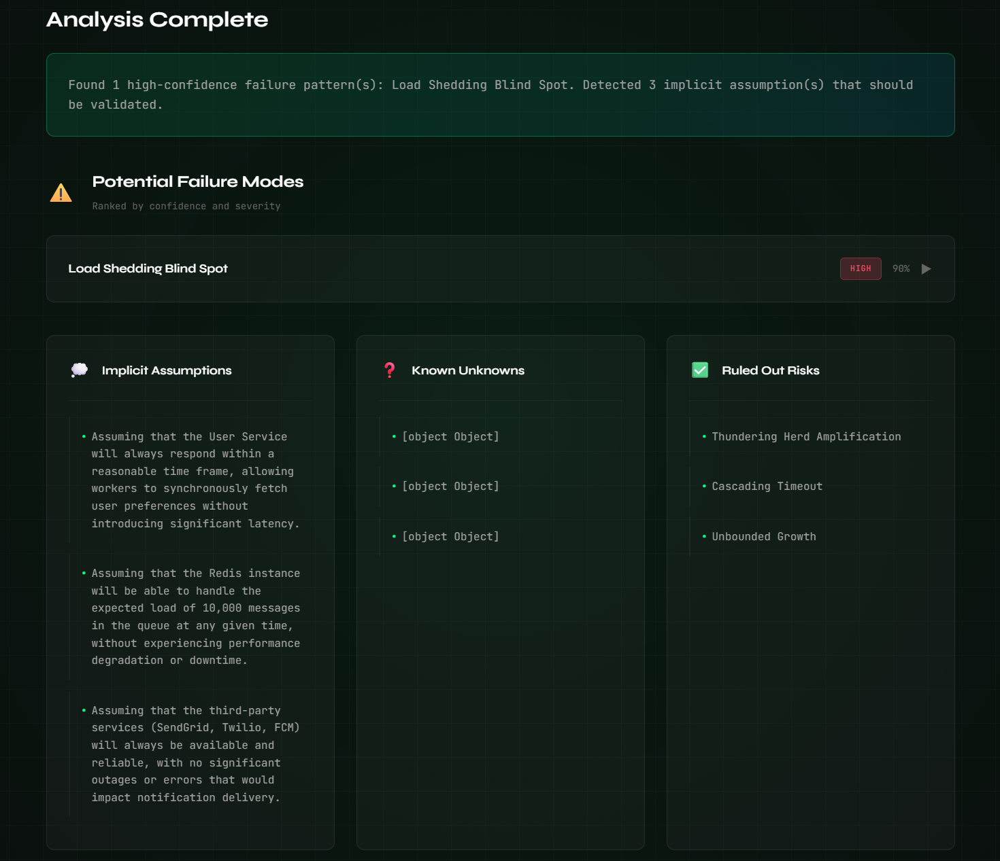

# Second Opinion

**Second Opinion** is a pre-mortem design review tool for distributed systems.  
It helps engineering teams identify *non-obvious failure modes* in system design documents — the kind that only show up under real production load, partial outages, or bad days at 3 a.m.

By mapping your design against a curated library of distributed-systems failure archetypes, Second Opinion surfaces subtle, emergent risks that traditional reviews often miss.

This project grew out of years of design reviews where the hardest failures were never the obvious ones.

---

## What It Does

Second Opinion analyzes architecture and design documents and produces a structured resilience review, including:

- Likely failure modes, ranked by confidence
- Implicit assumptions hidden in the design
- Critical unknowns or missing information
- Risks that were considered and ruled out

The goal is not to replace human judgment — it’s to make design reviews sharper, faster, and more complete.

---

## Features

- 🔍 **16+ Failure Patterns**  
  Curated distributed-systems failure archetypes

- 🎯 **Confidence Scoring**  
  High / Medium / Low confidence per finding

- 📊 **Structured Reports**  
  Clear evidence, triggers, and discussion prompts

- 🚀 **Fast Analysis**  
  Optimized prompts for local LLMs via Ollama

- 💻 **Clean UI**  
  Simple, modern web interface

---

## How It Works

1. You paste or upload a system design document
2. Optionally add context (scale, SLOs, dependencies)
3. The analyzer evaluates the design against known failure patterns
4. You receive a structured report highlighting risks and discussion points

The analysis focuses on *emergent behavior*, partial failures, and distributed-system edge cases — not syntax or style.

---

## Failure Patterns

Second Opinion currently evaluates designs against these curated patterns:

### Load Patterns
- Thundering Herd Amplification
- Load Shedding Blind Spot
- Retry Storm
- Hotspot / Hot Shard

### Dependency Patterns
- Hidden Synchronous Dependency
- Degraded but Not Dead

### Data Patterns
- Silent Data Loss
- Metadata Corruption
- Poison Message
- State Machine Explosion

### Timing Patterns
- Cascading Timeout
- Clock Skew Issues

### Resource Patterns
- Resource Exhaustion
- Unbounded Growth

### Distributed Patterns
- Partial Outage Inconsistency
- Version Skew
- Coordination Overhead

---

## Report Output

Each identified failure mode includes:

- Evidence from the design document
- Trigger conditions
- Why the issue is easy to miss
- Discussion questions for the team

---

## Project Structure

second_opinion/
├── app.py # FastAPI application
├── analyzer.py # Core analysis engine
├── patterns.py # Failure pattern definitions
├── llm.py # Ollama LLM integration
├── models.py # Pydantic data models
├── config.py # Configuration management
├── templates/ # HTML UI
├── static/ # CSS + JavaScript
└── tests/ # Basic tests

---

## API Overview

- **POST `/api/analyze`**  
  Analyze pasted text

- **POST `/api/upload`**  
  Upload and analyze a document file

- **GET `/api/patterns`**  
  List available failure patterns

- **GET `/api/health`**  
  Service and Ollama health check

Detailed examples and curl commands are in the Quick Start guide.

---

## Customization

### Add New Failure Patterns
Edit `patterns.py` to add or tune failure archetypes.

### Adjust Analysis Behavior
Modify `analyzer.py` to change:
- Prompts
- Confidence thresholds
- Analysis steps

### Change the LLM
Second Opinion uses local models via Ollama.  
Model selection is configurable via environment variables.

---

## Getting Started

For installation, configuration, usage examples, and deployment:

👉 **See [Quick Reference Guide](QUICKSTART.md)**

You can be up and running in about five minutes.

---

## Contributing

Contributions are welcome. See [CONTRIBUTING.md](CONTRIBUTING.md) for details.

---

## License

MIT License. See [LICENSE](LICENSE) for details.

---

**Note:** Second Opinion assists in design reviews but does not guarantee correctness or completen