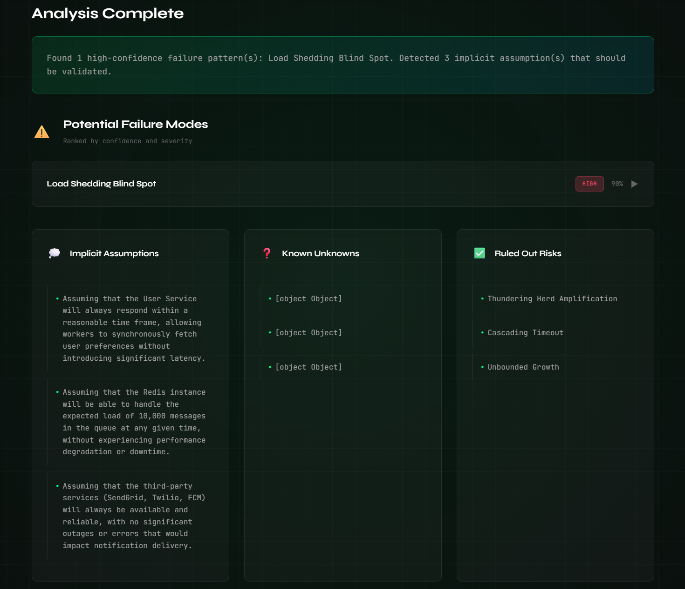

# Second Opinion

**Second Opinion** is a pre-mortem design review tool for distributed systems.  
It helps engineering teams identify *non-obvious failure modes* in system design documents — the kind that only show up under real production load, partial outages, or bad days at 3 a.m.

By mapping your design against a curated library of distributed-systems failure archetypes, Second Opinion surfaces subtle, emergent risks that traditional reviews often miss.

This project grew out of years of design reviews where the hardest failures were never the obvious ones.

---

## What It Does

Second Opinion analyzes architecture and design documents and produces a structured resilience review, including:

- Likely failure modes, ranked by confidence
- Implicit assumptions hidden in the design
- Critical unknowns or missing information
- Risks that were considered and ruled out

The goal is not to replace human judgment — it's to make design reviews sharper, faster, and more complete.

---

## Features

- 🔍 **24 Failure Patterns**  
  Curated distributed-systems failure archetypes

- 🎯 **Confidence Scoring**  
  High / Medium / Low confidence per finding

- 📊 **Structured Reports**  
  Clear evidence, triggers, and discussion prompts

- ⚡ **Parallel Analysis**  
  Pattern matching, assumption extraction, and unknown identification run concurrently

- 📡 **Live Progress**  
  Server-Sent Events stream progress updates to the UI as each step completes

- 📄 **PDF Support**  
  Upload design docs as PDF, Markdown, plain text, RST, or AsciiDoc

- 💾 **Export Results**  
  Copy the full report as Markdown or download as JSON

- 🔌 **Multi-provider LLM**  
  Use local models via Ollama or Claude via the Anthropic API

- 💻 **Clean UI**  
  Simple, modern web interface

---

## How It Works

1. You paste or upload a system design document
2. Optionally add context (scale, SLOs, dependencies)
3. The analyzer evaluates the design against known failure patterns
4. You receive a structured report highlighting risks and discussion points

The analysis focuses on *emergent behavior*, partial failures, and distributed-system edge cases — not syntax or style.

---

## Failure Patterns

Second Opinion evaluates designs against these 24 curated patterns:

### Load Patterns
- Thundering Herd Amplification
- Load Shedding Blind Spot
- Retry Storm
- Hotspot / Hot Shard
- Fan-out Amplification

### Dependency Patterns
- Hidden Synchronous Dependency
- Degraded but Not Dead
- Single Point of Failure
- Bulkhead Absence

### Data Patterns
- Silent Data Loss
- Metadata Corruption
- Poison Message
- State Machine Explosion
- Dual Write Inconsistency
- Missing Idempotency

### Timing Patterns
- Cascading Timeout
- Clock Skew Issues

### Resource Patterns
- Resource Exhaustion
- Unbounded Growth
- Noisy Neighbor

### Distributed Patterns
- Partial Outage Inconsistency
- Version Skew
- Coordination Overhead
- Event Ordering Assumption

---

## Report Output

Each identified failure mode includes:

- Evidence from the design document
- Trigger conditions
- Why the issue is easy to miss
- Discussion questions for the team



---

## Project Structure

```
second_opinion/
├── app/
│   ├── app.py            # FastAPI application (entrypoint: app.app:app)
│   ├── analyzer.py       # Core analysis engine
│   ├── patterns.py       # Failure pattern definitions
│   ├── llm.py            # Multi-provider LLM client (Ollama + Anthropic)
│   ├── models.py         # Pydantic data models
│   ├── config.py         # Pydantic settings
│   ├── templates/        # HTML UI (Jinja2)
│   └── static/           # CSS + JavaScript
├── samples/
│   └── example_design.md
├── Dockerfile
├── docker-compose.yml
├── requirements.txt
└── README.md
```

---

## API Overview

- **POST `/api/analyze`**  
  Analyze pasted text (non-streaming)

- **POST `/api/analyze/stream`**  
  Analyze pasted text with Server-Sent Events for live progress updates

- **POST `/api/upload`**  
  Upload and analyze a document file (.md, .txt, .rst, .adoc, .pdf)

- **GET `/api/patterns`**  
  List available failure patterns

- **GET `/api/health`**  
  Service and LLM health check

Detailed examples and curl commands are in [QUICKSTART.md](QUICKSTART.md).

---

## Configuration

Environment variables (compose sets sensible defaults):

| Variable | Default | Description |
|---|---|---|
| `LLM_PROVIDER` | `ollama` | `ollama` or `anthropic` |
| `OLLAMA_MODEL` | `llama3` | Ollama model name |
| `OLLAMA_BASE_URL` | `http://localhost:11434` | Ollama server URL |
| `OLLAMA_TIMEOUT` | `120` | Request timeout in seconds |
| `ANTHROPIC_API_KEY` | _(empty)_ | Required when `LLM_PROVIDER=anthropic` |
| `ANTHROPIC_MODEL` | `claude-sonnet-4-6` | Anthropic model ID |
| `MAX_DOCUMENT_SIZE` | `50000` | Max input characters |
| `CONFIDENCE_THRESHOLD` | `0.6` | Minimum match score to include a finding |
| `MAX_FAILURE_MODES` | `10` | Maximum findings returned |

## Customization

### Add New Failure Patterns
Edit `app/patterns.py` to add or tune failure archetypes. Each pattern is a `FailurePattern` with an `id`, `name`, `description`, `category`, `indicators` list, and `why_easy_to_miss` string.

### Adjust Analysis Behavior
Modify `analyzer.py` to change:
- Prompts
- Confidence thresholds
- Analysis steps

### Change the LLM
Set `LLM_PROVIDER=ollama` and configure `OLLAMA_MODEL` for local inference, or set `LLM_PROVIDER=anthropic` with `ANTHROPIC_API_KEY` to use Claude.

---

## Quick Start

### Run with Docker Compose (recommended)

```bash
docker compose up --build
```

Then open: http://localhost:8000

Services:
- `ollama`: serves models at http://localhost:11434
- `web`: FastAPI app at http://localhost:8000

Select a model:
```bash
OLLAMA_MODEL=llama3 docker compose up --build
```

### Run locally without Docker

```bash
python -m venv venv
venv\Scripts\activate   # or: source venv/bin/activate
pip install -r requirements.txt

# Start Ollama in another terminal and pull a model
ollama serve
ollama pull llama3

# Start the app
uvicorn app.app:app --reload
```

Open http://localhost:8000

### Use Anthropic Claude instead of Ollama

```bash
export LLM_PROVIDER=anthropic
export ANTHROPIC_API_KEY=sk-ant-...
uvicorn app.app:app --reload
```

---

## Contributing

Contributions are welcome. See [CONTRIBUTING.md](CONTRIBUTING.md) for details.

---

**Note:** Second Opinion assists in design reviews but does not guarantee correctness or completeness. It surfaces potential failure modes based on known patterns — always apply human judgment to the results.
